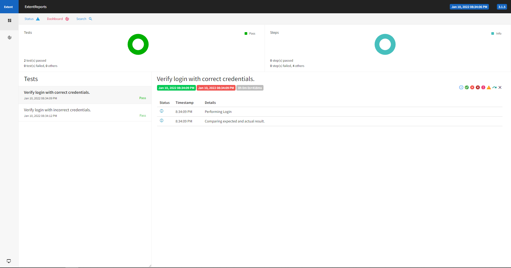
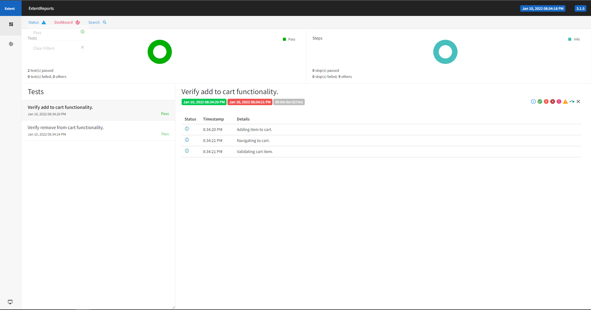
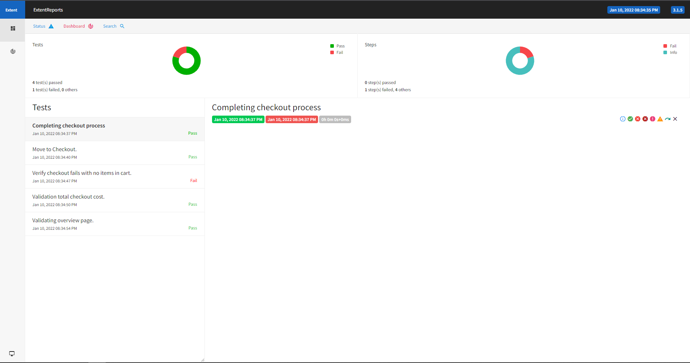

# SwagLabs Automation Testing

Automation testing of [SwagLabs](https://www.saucedemo.com/) done using Selenium .[SwagLabs](https://www.saucedemo.com/) is a demo ecommerce website.
TDD(Test Driven Development) approach is used and unit tests are written using TestNG which is a automation testing framework.

Page Object Model, also known as POM, is used in this project. POM is a design pattern in Selenium that creates an object repository for storing all web elements. 

Each webpage of application is considered as a class file. It is useful in reducing code duplication and improves test case maintenance.

## Functionalities tested :

 - Login 
    - Login with correct credentials.
    - login with incorrect credentials.
    
 - Cart
    - Validating add to cart functionality.
    - Validating remove from cart functionality.
    
 - Checkout
    - Validating checkout overview page.
    - Validating total checkout cost by adding 8% tax .
    - Verifyng if checkout fails when no item is added to cart.

## Reports

Reports are generated using Extent Reporting Framework.

### [Login Report](./reports/swagLabsTestReport-Login.html)

### [Cart Report](./reports/swagLabsTestReport-Cart.html)

### [Checkout Report](./reports/swagLabsTestReport-Checkout.html)

## Technologies used

- Selenium
- TestNG
- Extent Report
